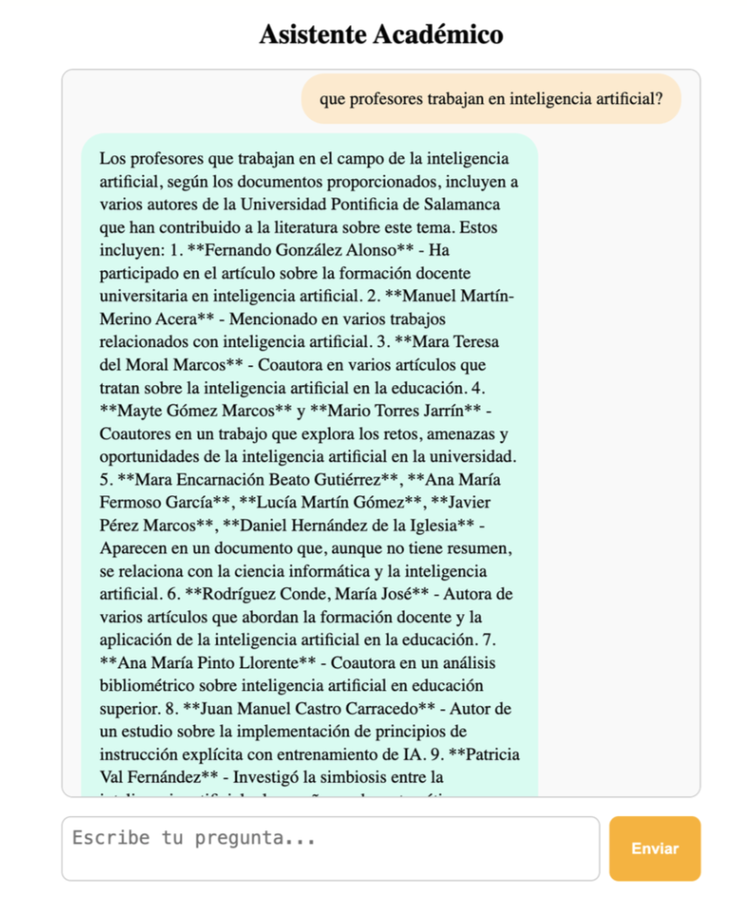

# RAG Chatbot — Academic Publications Assistant


A full Retrieval-Augmented Generation (RAG) system that allows users to query academic publications from the scientific portal of the Universidad Pontificia de Salamanca. The data was extracted via web crawling with Apache Nutch, semantically indexed with FAISS and OpenAI embeddings, and served through a FastAPI backend with an Angular chat interface.

---

## Problem Statement

Academic institutions generate large volumes of research publications that are difficult to search with traditional keyword queries. Researchers and students need a way to ask natural-language questions like *"Which authors work in artificial intelligence?"* or *"What publications has Dr. X co-authored?"* and get grounded, accurate answers — not hallucinated responses.

This system solves that by combining semantic vector search with a large language model, ensuring answers are always grounded in real retrieved documents from the institution's own scientific portal.

---

## Screenshot

### Chatbot in action
Asking which teachers work with AI — the system retrieves relevant publications and generates a natural language response with author names and article references.



---

## How It Works

```
User Query
    ↓
Angular Frontend (chat UI)
    ↓
FastAPI Backend (POST /chat)
    ↓
RAG Engine
    ├── Query → Embedding (text-embedding-3-small)
    ├── FAISS similarity search → Top-K documents
    └── Context + Query → GPT-4 Turbo → Natural language answer
    ↓
Response rendered in chat
```

### Retrieval Stage
The user's query is converted into a high-dimensional vector using the same embedding model used to index the documents. FAISS performs a similarity search (L2 distance) across the full corpus and returns the most semantically relevant publications.

### Generation Stage
The retrieved documents are injected as context into a GPT-4 Turbo prompt with strict instructions: answer only using the provided documents, write in natural narrative language, and explicitly state when information is unavailable.

---

## Features

- **Natural language queries** over a corpus of academic publications
- **Semantic search** — finds relevant documents even without exact keyword matches
- **Hallucination prevention** — the model is instructed to rely exclusively on retrieved documents
- **Multi-turn conversations** with dynamic token management to stay within model limits
- **Real-time chat interface** with loading indicators and error handling
- **Source-grounded answers** — responses reference which documents were used

---

## Data Pipeline

```
Apache Nutch crawler
        ↓
Raw HTML dump
        ↓
Cleaning & transformation (Python)
        ↓
Structured JSON (output_clean3.json)
        ↓
Embedding generation (embeddings.py)
        ↓
FAISS index + metadata store
```

Each document in the JSON contains:

```json
{
  "title": "...",
  "authors": ["Author1", "Author2"],
  "summary": "...",
  "year_of_publication": "...",
  "isbn_issn": "...",
  "congress": "...",
  "type_of_publication": "..."
}
```

---

## Tech Stack

| Layer | Technology | Reason |
|-------|-----------|--------|
| Frontend | Angular 17 | Component-based chat UI with reactive services |
| Language (frontend) | TypeScript | Type safety, Angular native |
| Backend | FastAPI | Async Python API, minimal overhead |
| LLM | GPT-4 Turbo | Best-in-class generation quality |
| Embeddings | text-embedding-3-small | Efficient, high-quality semantic vectors |
| Vector store | FAISS (IndexFlatL2) | Fast similarity search over large corpora |
| Data extraction | Apache Nutch | Scalable web crawler for the scientific portal |
| Data processing | Python + NumPy | Embedding generation and index persistence |

---

## Project Structure

```
Chatbot/
├── frontend/
│   └── src/app/
│       ├── chat.component.ts      # Chat UI logic
│       ├── chat.component.html    # Chat template
│       ├── chat.component.css     # Styles
│       └── services/
│           └── chat.service.ts    # HTTP service → FastAPI
└── es/upsa/tfg/
    ├── main.py                    # FastAPI app — POST /chat
    ├── ai.py                      # RAG engine (retrieval + generation)
    ├── embeddings.py              # Embedding generation + FAISS indexing
    ├── output_clean3.json         # Cleaned publication data
    ├── faiss_index.bin            # FAISS index (generated, not in repo)
    ├── doc_metadata.pkl           # Document metadata (generated, not in repo)
    └── embeddings.npy             # Stored vectors (generated, not in repo)
```

> **Note:** `faiss_index.bin`, `doc_metadata.pkl`, and `embeddings.npy` are generated locally by running `embeddings.py`. They are too large to commit to the repository.

---

## Token Management

To avoid exceeding model context limits:
- Maximum context window: **18,000 tokens**
- Conversation history is dynamically trimmed — oldest messages removed first
- System instructions are always preserved
- This ensures stable multi-turn conversations even on long sessions

---

## API

### `POST /chat`

**Request:**
```json
{
  "text": "Which authors work in artificial intelligence?"
}
```

**Response:**
```json
{
  "response": "Several researchers at UPSA work in the field of artificial intelligence..."
}
```

CORS is enabled for Angular integration on `localhost:4200`.

---

## Running Locally

### Prerequisites
- Python 3.11+
- Node.js 18+ and Angular CLI
- OpenAI API key

### Backend

```bash
# Clone the repository
git clone https://github.com/AdrianMalmierca/chatbot-rag
cd Chatbot/es/upsa/tfg

# Install Python dependencies
pip install fastapi uvicorn openai faiss-cpu numpy

# Generate the FAISS index (run once)
python embeddings.py

# Start the backend
uvicorn main:app --reload --port 8000
```

### Frontend

```bash
cd Chatbot/frontend

# Install dependencies
npm install

# Start the Angular dev server
ng serve
```

Open [http://localhost:4200](http://localhost:4200).

---

## System Capabilities

The assistant can:
- Retrieve publications by research topic
- List all publications by a specific author
- Identify co-authorship relationships between researchers
- Count researchers working in a given area
- Confirm whether two authors have collaborated
- Explicitly state when the requested information is not in the corpus

---

## Future Improvements

- **Persistent user sessions** — store conversation history server-side
- **Semantic re-ranking** — apply a cross-encoder to re-rank retrieved documents before generation
- **Metadata filtering** — filter by year, publication type, or research area before retrieval
- **Dockerized deployment** — containerize both frontend and backend
- **Managed vector database** — replace FAISS with Pinecone or Weaviate for production scale
- **Authentication system** — user accounts with query history
- **Author disambiguation** — handle authors with similar names in the corpus

---

## What I Learned Building This

**RAG architecture end-to-end** — this was my first AI project, and building it from scratch taught me how retrieval and generation work together. The key insight: the quality of the answer depends more on retrieval quality than on the LLM itself — garbage in, garbage out.

**Web crawling at scale** — using Apache Nutch to extract data from a real institution's portal was my first experience with crawlers. Understanding the full pipeline from raw HTML dump to clean structured JSON gave me a practical understanding of data engineering.

**Prompt engineering** — writing effective system prompts that prevent hallucination while maintaining natural language output required significant iteration. Constraints like "do not invent information" and "explicitly state when data is unavailable" turned out to be critical.

**Embeddings and vector search** — understanding why semantic search outperforms keyword search, how FAISS indexes vectors for fast retrieval, and how the choice of embedding model affects result quality was a foundational learning in applied ML.

**Full-stack integration across different stacks** — connecting an Angular frontend to a Python FastAPI backend across different runtimes was a first for me. Managing CORS, request/response contracts, and session IDs across the boundary taught me a lot about how full-stack systems actually communicate.

**Token budget management** — LLMs have hard context limits. Building a dynamic trimming strategy that preserves system instructions while discarding old history was a practical introduction to the constraints of working with production LLM APIs.

---

## License

MIT — free to use, modify, and deploy.

---

## Author

**Adrián Martín Malmierca**  
Computer Engineer & Mobile Applications Master's Student  
[GitHub](https://github.com/AdrianMalmierca) · [LinkedIn](https://www.linkedin.com/in/adri%C3%A1n-mart%C3%ADn-malmierca-4aa6b0293/)